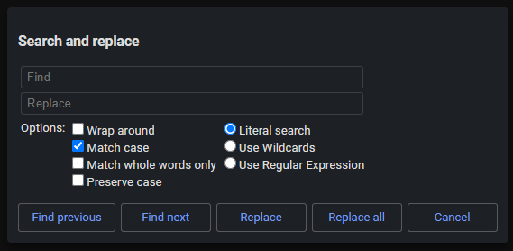
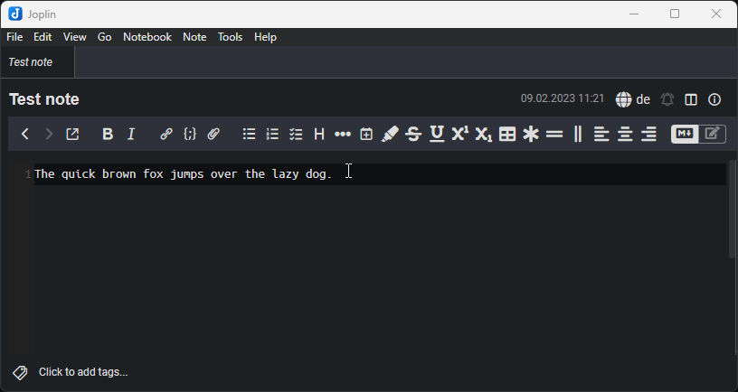
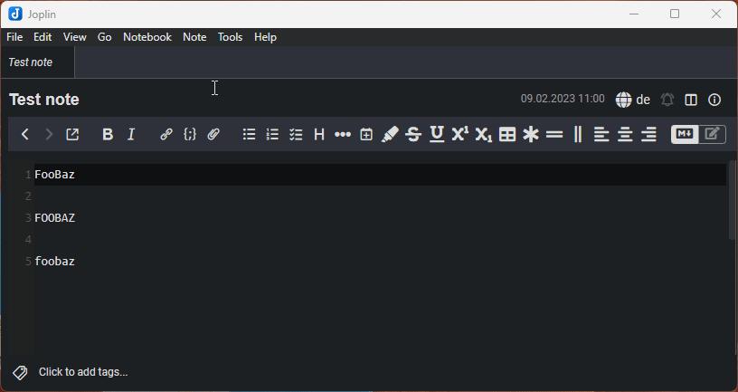

<table>
    <tr>
        <td colspan="3" align="center">
            <h3>Search & Replace</h3>
        </td>
    </tr>
    <tr>
        <td width="225px" rowspan="7" align="center">
            <br>
            <p>
                <strong>Joplin Plugin</strong><br>
                Search & Replace
            </p>
        </td>
    </tr>
    <tr>
        <td colspan="2"><strong>Adds a search and replace panel.</strong></td>
    </tr>
    <tr>
        <td colspan="2">
            
            
        </td>
    </tr>
    <tr>
        <td>Links:</td>
        <td>
            <a href="https://www.npmjs.com/package/joplin-plugin-search-and-replace">
                
            </a>
            <a href="https://discourse.joplinapp.org/t/plugin-search-and-replace/29242">
                
            </a>
        </td>
    </tr>
    <tr>
        <td>Built with:</td>
        <td>
            <a href="https://github.com/laurent22/joplin/tree/dev/packages/generator-joplin">generator-joplin</a>,
            <a href="https://github.com/jedwards1211/preserve-case">preserve-case</a> (which is based on <a href="https://github.com/nbubna/Case">Case</a>)
        </td>
    </tr>
    <tr>
        <td>Inspired by:</td>
        <td>
            <a href="https://github.com/cqroot/joplin-outline">Joplin Outline Plugin</a>
        </td>
    </tr>
    <tr>
        <td>Other plugins by me:</td>
        <td>
            <a href="https://github.com/FelisDiligens/joplin-plugin-multimd-table-tools">MultiMarkdown Table Tools</a>,
            <a href="https://github.com/FelisDiligens/joplin-plugin-cmoptions">CodeMirror Options</a>
        </td>
    </tr>
</table>

Once this plugin is installed, you can press `Ctrl`+`H` in the Markdown editor or click on `Edit` → `Search and replace`.

> **Note**  
> The dialog has been replaced with a panel in v2.0.0  
> You can pick between the panel and dialog in the settings (see screenshots)

## 📸 Screenshots

> Panel


> Dialog


> Demo

## ✨ Features

- **Search and/or replace within a note.**
  - Search for something in a note with more options than the built-in search.
  - Replace one by one.
  - Replace all matches in a note.
- **Search pattern types:**
  - **Literal**
  - **Wildcards**
  - **Regular Expressions**
- **Options:**
  - **Match case:** When unchecked, ignore whether a letter is upper or lower case.
  - **Match whole words only:** The entire word has to match the search pattern.
  - **Preserve case**
  - **Wrap around:** When you reach the end of the note, it will wrap around to the beginning of the note (and vice versa).

## ⚙️ Installation

### From the repo (recommended)

- Go to the settings (Tools → Options) → Plugins
- Search for `Search & Replace`
- Click 'Install' and restart Joplin
- Enjoy

### Manually

- Download the *.jpl file from the [releases](https://github.com/FelisDiligens/joplin-plugin-search-and-replace/releases) section
- Go to the settings (Tools → Options) → Plugins
- Click the gear next to 'Manage your plugins' and choose 'Install from file'
- Select the downloaded *.jpl file
- Restart Joplin
- Enjoy

## ⚡ Usage

Open a note in the Markdown editor. Click on `Edit` in the menu bar and then on `Search and replace`. This will open a panel on the right.

If you click on "Replace next", it will replace the next occurence relative to your I-beam (or cursor).  
If you click on "Replace all", it will replace all occurences in the note.

### Wildcards

If you select 'Use Wildcards', it will let write a search pattern with these wildcards:
- `?`  - any character  (one and only one)  
- `*`  - any characters (zero or more)  
- `\?` - a question mark  
- `\*` - an asterisk

### Regular Expressions

You can also enable "Regular Expressions". This will interpret the search pattern as a regex. See [MDN docs](https://developer.mozilla.org/en-US/docs/Web/JavaScript/Guide/Regular_Expressions) and [Wikipedia](https://en.wikipedia.org/wiki/Regular_expression)

What also works with regex is using groups, e.g. like this:  
Search: `(foo)([a-z]+)`  
Replace: `$1 bar $2`  

Before: `foobaz`  
After: `foo bar baz`

### Preserve case

> **Warning** Preserve case can sometimes behave differently than expected.

This option can be useful if you want to replace certain words in texts or refactor code/tables/etc.




## Development

<details>
<summary>Text from "generator-joplin"</summary>

This is a template to create a new Joplin plugin.

The main two files you will want to look at are:

- `/src/index.ts`, which contains the entry point for the plugin source code.
- `/src/manifest.json`, which is the plugin manifest. It contains information such as the plugin a name, version, etc.

## Building the plugin

The plugin is built using Webpack, which creates the compiled code in `/dist`. A JPL archive will also be created at the root, which can use to distribute the plugin.

To build the plugin, simply run `npm run dist`.

The project is setup to use TypeScript, although you can change the configuration to use plain JavaScript.

### Workaround: Building fails on NodeJS LTS

```bash
export NODE_OPTIONS=--openssl-legacy-provider
```
> Source: https://stackoverflow.com/a/69746937


## Updating the plugin framework

To update the plugin framework, run `npm run update`.

In general this command tries to do the right thing - in particular it's going to merge the changes in package.json and .gitignore instead of overwriting. It will also leave "/src" as well as README.md untouched.

The file that may cause problem is "webpack.config.js" because it's going to be overwritten. For that reason, if you want to change it, consider creating a separate JavaScript file and include it in webpack.config.js. That way, when you update, you only have to restore the line that include your file.

</details>
