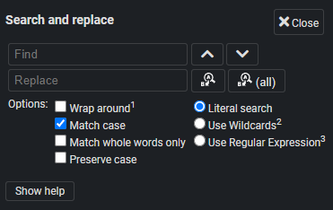

<table>
    <tr>
        <td colspan="3" align="center">
            <h3>Search & Replace</h3>
        </td>
    </tr>
    <tr>
        <td width="225px" rowspan="6" align="center">
            <br>
            <p>
                <strong>Joplin Plugin</strong><br>
                Search & Replace
            </p>
        </td>
    </tr>
    <tr>
        <td colspan="2"><strong>Adds a simple search and replace dialog.</strong></td>
    </tr>
    <tr>
        <td colspan="2">
            
            
        </td>
    </tr>
    <tr>
        <td>Links:</td>
        <td>
            <a href="https://www.npmjs.com/package/joplin-plugin-search-and-replace">
                
            </a>
        </td>
    </tr>
    <tr>
        <td>Built with:</td>
        <td>
            <a href="https://github.com/laurent22/joplin/tree/dev/packages/generator-joplin">generator-joplin</a>
        </td>
    </tr>
    <tr>
        <td>Other plugins by me:</td>
        <td>
            <a href="https://github.com/FelisDiligens/joplin-plugin-multimd-table-tools">MultiMarkdown Table Tools</a>,
            <a href="https://github.com/FelisDiligens/joplin-plugin-cmoptions">CodeMirror Options</a>
        </td>
    </tr>
</table>

Once this plugin is installed, you can press `Ctrl`+`H` in the Markdown editor or click on `Edit` → `Search and replace`.

## 📸 Screenshot


## ⚙️ Installation

### From the repo (recommended)

- Go to the settings (Tools → Options) → Plugins
- Search for `Search & Replace`
- Click 'Install' and restart Joplin
- Enjoy

### Manually

- Download the *.jpl file from the [releases](https://github.com/FelisDiligens/joplin-plugin-search-and-replace/releases) section
- Go to the settings (Tools → Options) → Plugins
- Click the gear next to 'Manage your plugins' and choose 'Install from file'
- Select the downloaded *.jpl file
- Restart Joplin
- Enjoy

## ⚡ Usage

Open a note in the Markdown editor. Click on `Edit` in the menu bar and then on `Search and replace`. This will open a dialog.

If you click on "Replace next", it will replace the next occurence relative to your I-beam (or cursor). When you open the dialog again (e.g. with `Ctrl`+`H`), it will remember the last text you entered, which makes it easy to repeat the last replacement.

If you click on "Replace all", it will replace all occurences in the note.

You can check "Case insensitive", so it doesn't check for upper or lower case characters.

You can also enable "Regular Expressions". This will interpret the search pattern as a regex. See [MDN docs](https://developer.mozilla.org/en-US/docs/Web/JavaScript/Guide/Regular_Expressions) and [Wikipedia](https://en.wikipedia.org/wiki/Regular_expression).

## Development

<details>
<summary>Text from "generator-joplin"</summary>

This is a template to create a new Joplin plugin.

The main two files you will want to look at are:

- `/src/index.ts`, which contains the entry point for the plugin source code.
- `/src/manifest.json`, which is the plugin manifest. It contains information such as the plugin a name, version, etc.

## Building the plugin

The plugin is built using Webpack, which creates the compiled code in `/dist`. A JPL archive will also be created at the root, which can use to distribute the plugin.

To build the plugin, simply run `npm run dist`.

The project is setup to use TypeScript, although you can change the configuration to use plain JavaScript.

### Workaround: Building fails on NodeJS LTS

```bash
export NODE_OPTIONS=--openssl-legacy-provider
```
> Source: https://stackoverflow.com/a/69746937


## Updating the plugin framework

To update the plugin framework, run `npm run update`.

In general this command tries to do the right thing - in particular it's going to merge the changes in package.json and .gitignore instead of overwriting. It will also leave "/src" as well as README.md untouched.

The file that may cause problem is "webpack.config.js" because it's going to be overwritten. For that reason, if you want to change it, consider creating a separate JavaScript file and include it in webpack.config.js. That way, when you update, you only have to restore the line that include your file.

</details>
